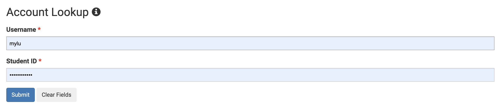
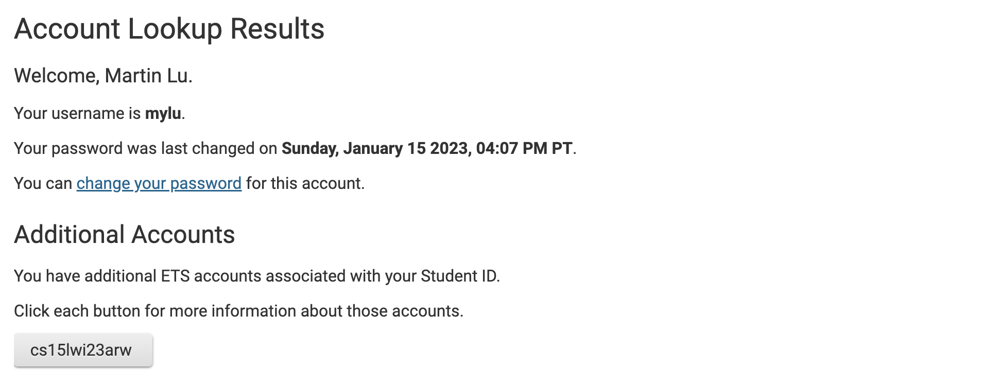
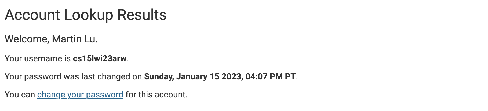
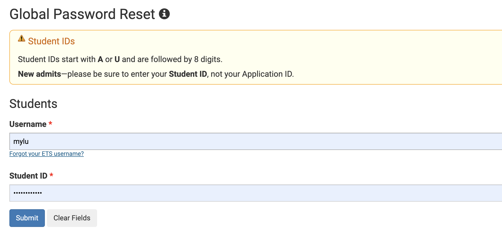
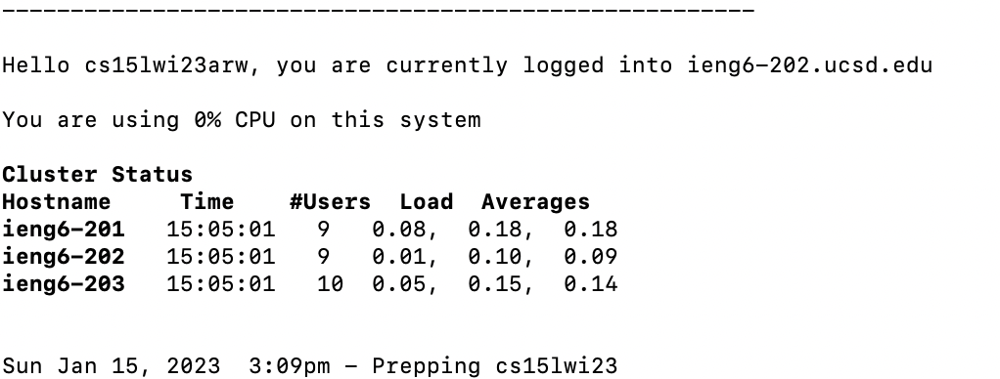
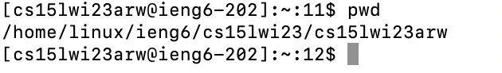
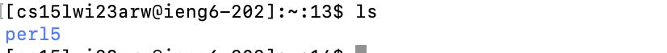

# Connecting to UCSD CSE15L remote server
1) Find your CSE15L account name
2) Set/Reset your account password
3) Connect to server via ssh
___
##Find your CSE15L account name
Find your course specific account name at [sdacs.ucsd.edu/~icc/index.php](https://sdacs.ucsd.edu/~icc/index.php)
To find your account name: 
1) Sign in via **Account Lookup** with your UCSD username and _student id_. 

2) Your CSE15L account name should be visible under __Additional Accounts__. It should begin with `cse15lwi23`. Click the account button to access information and set/reset passwords.

##Set/Reset your account password
To set your account password: 
1) Change your CSE15L specific password on this screen. If you already set your password (as I have), skip this step. If you haven't / forgot your password, continue.

2) Sign in to __Global Password Reset__ with your username and _student id_.

2) Fill in the form with old and new password. You will likely have to wait 10 minutes for the new password to function. 

##Connect to server via ssh
Open terminal and run the following command
> `ssh`__`<account-name>`__`@ieng6.ucsd.edu` 

where __`<account-name>`__  is the cse14lw23.. found earlier.

The terminal will then prompt you for your password. 
If your password does not work, endsure it is typed correctly, wait longer for the password to activate, or reset it again (ensuring that the second option is set to __yes__).

If all is functioning, the following should appear allowing you to send commands to the server.

___
##Testing terminal commands

The `pwd` command returns the current working directory, the folder I am currently accessing.
Running the command `pwd` yields `/home/linux/ieng5/cse15lwi23/cs15lwi23arw`, my home directory.

The `ls` command lists all the files and directories present in the current working directory.
Running the command `ls` yields `perl5`, indicating that only one directory - perl5 - exists in the home directory.

